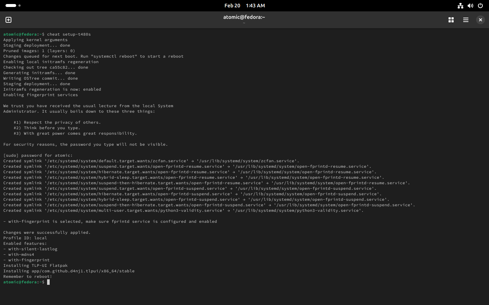

# atomic-t480s

A collection of Atomic Fedora images loaded with utilities for Lenovo T480/s functionality. These images are suitable for daily operations.

Images are built every Tuesday, Thursday, and Friday at 08:00 UTC.

## Highlights

- All images are based on Fedora's official `:latest` images, so the image will also follow Atomic Fedora's `:latest` versions. I do not plan to maintain multiple versions, such as `n-1` or `:rawhide`. Be aware that builds may fail right after the major version bump, in which case I will monitor them and take measures as I see fit (e.g. replace COPRs with actively maintained versions).
- Multimedia codecs, intel-vaapi-driver & MESA packages from RPMFusion & fedora-multimedia, eliminating the need to manually layer codecs
- `btrfs-assistant` installed for snapshots & BTRFS maintenance
- `distrobox` installed for a better container experience
- `fish` and `zsh` shells installed natively, ready for use
- Lenovo T480/s utilities integrated in the image - `python-validity` for fingerprint sensors, `throttled` for undervolting, `TLP` for power management, and `zcfan` for hassle-free fan-control
- Qogir & Tela default icons installed at the system level
- IBM Plex Sans & Mono, Ubuntu Sans & Mono installed from Google Fonts at the system level

### Enabling T480s features

All images are equipped with a command to automate set-up of all services - `python-validity`, `TLP`, and `zcfan`. `throttled` automation is NOT included, as it requires the user's own testing and adjustments.

To automatically configure these utilities, run `cheat setup-t480s`, which configures the following in order:

1. Apply `thinkpad_acpi.fan_control=1` kernel arguments for `zcfan` as well as `sysrq_always_enabled=1` for safety
2. Enables local `initramfs` regeneration
3. Enables fingerprint sensor drivers
4. Installs TLP-UI Flatpak

Reboot must be done before the features can work as expected.

## Silverblue

| preview 	| preview 	|
|---	|---	|
|  	|  	|
| GDM 	| Desktop 	|
|  	|  	|
| The terminal after running `cheat setup-t480s` 	| Preconfigured app drawer, after Flatpaks are successfully installed 	|

 Silverblue images are equpped with a lineup of default GNOME apps as system Flatpaks. In addition, I have also made minor changes to the GNOME environment to improve user experience.
 
As a user who enjoys GNOME's way of things, who also recognizes that there are minor but impactful improvements that can be made to the GNOME environment, I've decided to equip it with the following convenient and useful extensions automatically enabled:

- Alphabetical App Grid
- AppIndicator and KStatusNotifierItem Support
- Bluetooth Battery Meter
- Caffeine
- Just Perfection
- Night Theme Switcher

From my humble perspective, these extensions do not modify the essence of the GNOME way, but rather enhance it, and so I have decided to bring them to you too.

In addition, [nautilus-copy-path](https://github.com/chr314/nautilus-copy-path) is also installed by default at a system level.

Minor `gschemas` changes have also been made, which affects:

- favorite apps
- default background image
- accent color set to purple & default fonts (set to Ubuntu Sans 10.5 - it's *very* pretty, pleasant, and performant!)
- set Mutter to wait 30s before an app is considered not responding
- Nautilus set to show link options & permanent file deletion

### Silverblue: Installation

You can rebase from an existing Silverblue installation and running the commands below.

> Remember to reset all of your layered packages before proceeding!

1. Rebase to the unsigned version of the image.
  ```
  rpm-ostree rebase ostree-unverified-registry:ghcr.io/askpng/silverblue:latest
  ```
2. Reboot your system.
  ```
  systemctl reboot
  ```
3. Rebase to the signed version of the image.
  ```
  rpm-ostree rebase ostree-image-signed:docker://ghcr.io/askpng/silverblue:latest
  ```
4. Reboot your system.
  ```
  systemctl reboot
  ```

## Kinoite

Kinoite users get a fairly default KDE experience - mainly because I do not have much experience and interest in tinkering with KDE. However, I have made sure to include [Koi](https://github.com/baduhai/Koi) and [Kvantum](https://github.com/tsujan/Kvantum/) for your convenience! 

KDE essentials are also installed as system Flatpaks. 

### Kunoite: Installation

You can rebase from an existing Kinoite installation and running the commands below.

> Remember to reset all of your layered packages before proceeding!

1. Rebase to the unsigned version of the image.
  ```
  rpm-ostree rebase ostree-unverified-registry:ghcr.io/askpng/kinoite:latest
  ```
2. Reboot your system.
  ```
  systemctl reboot
  ```
3. Rebase to the signed version of the image.
  ```
  rpm-ostree rebase ostree-image-signed:docker://ghcr.io/askpng/kinoite:latest
  ```
4. Reboot your system.
  ```
  systemctl reboot
  ```

## Verification

These images are signed with [Sigstore](https://www.sigstore.dev/)'s [cosign](https://github.com/sigstore/cosign). You can verify the signature by downloading the `cosign.pub` file from this repo and running the following command:

```bash
cosign verify --key cosign.pub ghcr.io/askpng/atomic-t480s
```
